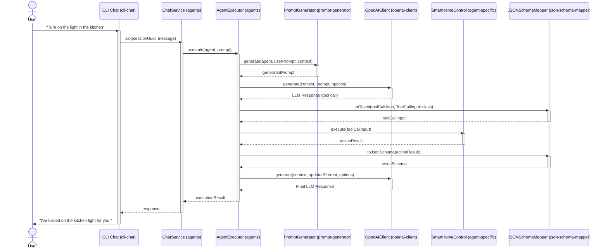

# The most powerful LLM Agents framework for PHP

👋 Welcome to LLM Agents PHP!

This PHP framework allows developers to create and manage **Language Model (LLM) based agents** in **PHP applications**. Perfect for building **autonomous systems** that interact with APIs, process natural language, and perform complex tasks.

## ✨ Key Features

- **🤖 Agent Creation:** Create and configure **LLM-based agents** in PHP with customizable behaviors.
- **🔧 Tool Integration:** Seamlessly integrate various tools and APIs for agent use in PHP applications.
- **🧠 Memory Management:** Support for agent memory, enabling information retention and recall across interactions.
- **💡 Prompt Management:** Efficient handling of prompts and instructions to guide agent behavior.
- **🔌 Extensible Architecture:** Easily add new agent types, tools, and capabilities to your PHP projects.
- **🤝 Multi-Agent Support:** Build systems with multiple interacting agents for complex problem-solving scenarios in PHP.

## 📂 Our packages
- **🧠 [LLM Agents Core](https://github.com/llm-agents-php/agents):** The core library for building LLM-based agents in PHP. It's the brain of our operation!
- **🎭 [Prompt Generator](https://github.com/llm-agents-php/prompt-generator):** A cool tool for generating chat prompts with all the system and user messages your agents need.
- **🔌 [OpenAI Client](https://github.com/llm-agents-php/openai-client):** Your ticket to seamlessly integrate OpenAI's API into your LLM Agents projects.
- **💬 [CLI Chat](https://github.com/llm-agents-php/cli-chat):** A nifty CLI chat interface for chatting with LLM agents. Perfect for testing or building CLI chatbots!
- **🗺️ [JSON Schema Mapper](https://github.com/llm-agents-php/schema-mapper):** A handy tool for converting between PHP classes and JSON schemas, and vice versa.
- **🚀 [Sample Application](https://github.com/llm-agents-php/sample-app):** See LLM Agents PHP in action! This demo app shows you how to put all these cool tools to work.

### Understanding the LLM Agents Ecosystem

Here's a UML sequence diagram that shows you exactly what goes down when a user asks their [smart home agent](https://github.com/llm-agents-php/agent-smart-home-control) to turn on the kitchen light.

> Read more [here](https://github.com/llm-agents-php/agents/wiki/Toolkit-for-Building-Smart-AI-Assistants)

## 💬 Community and Support

Join our **PHP developer community** to contribute, discuss, and report issues:

- **🛠️ Contribute:** Check out our repositories for contribution guidelines to enhance LLM Agents PHP.
- **💬 Discussions:** Engage with other PHP developers in GitHub Discussions about LLM Agents.
- **🐛 Issues:** Report bugs or request new features through GitHub Issues to improve the framework.

## 🔔 Stay Updated

Follow us on GitHub for the latest updates on LLM Agents PHP, and star our repositories to show your support and stay informed about new releases.
